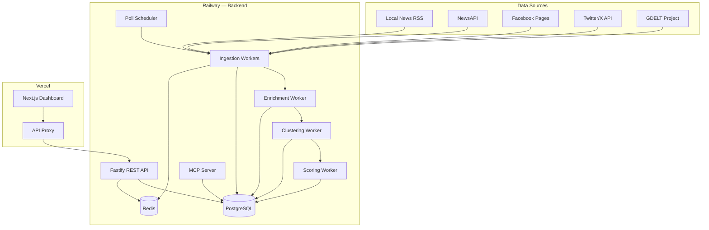

# Houston Breaking News Intelligence Platform — Technical Architecture

> Sections 1–8 below. Sections 9–16 in [ARCHITECTURE-PART2.md](./ARCHITECTURE-PART2.md).

---

## SECTION 1 — Reality Check and Feasibility

### Facebook

| Access Method | Description | Viability |
|---|---|---|
| Graph API (Pages) | Read public Page posts via `/{page-id}/posts`. Requires App Review for `pages_read_engagement`. Returns text, reactions, shares, comments count. Rate: 200 calls/hr/token. | **✅ Viable now** |
| Graph API (Groups) | Requires group admin approval + `groups_access_member_info`. Most local groups won't grant this. | **⚠️ Viable with partnerships only** |
| Personal profiles / News Feed | No API access whatsoever. | **❌ Not viable** |
| CrowdTangle | Shut down August 14, 2024. Dead. | **❌ Dead** |
| Meta Content Library | Research-only. Requires academic affiliation + IRB. Cannot be used commercially. | **❌ Not viable** |
| Scraping | Violates ToS. Accounts banned. IP blocks. Meta aggressively litigates. | **❌ High risk** |

**Bottom line**: We can read public Page posts from curated Houston news/government pages via an approved app. That's it.

### Instagram

| Access Method | Description | Viability |
|---|---|---|
| Basic Display API | Deprecated April 4, 2024. Gone. | **❌ Dead** |
| Instagram Graph API | Only works for Business/Creator accounts that grant your app permission. No public search. No discovery. Hashtag search only for authorized accounts. | **⚠️ Viable with partnerships** |
| Scraping | Instagram aggressively blocks automated access. | **❌ High risk** |

**Bottom line**: Unless Houston news orgs install your app, Instagram is effectively inaccessible. Deprioritize for v1.

### Nextdoor

| Access Method | Description | Viability |
|---|---|---|
| Public API | Does not exist. No developer program. | **❌ Not viable** |
| Scraping | Content behind auth. Private by default. ToS violation. | **❌ High risk** |
| Data partnerships | Select municipal partnerships only. Not available to startups. | **❌ Not viable** |

**Bottom line**: Nextdoor is completely off the table.

### Viable Alternative Sources

| Source | Access Method | Viability | Data Quality | Cost |
|---|---|---|---|---|
| Local News RSS | Standard RSS/Atom feeds | ✅ Viable now | High | Free |
| NewsAPI.org | REST API with key | ✅ Viable now | High | Free (100/day), $449/mo prod |
| Twitter/X API v2 | OAuth 2.0 Bearer | ✅ Viable now | Medium-High | $100/mo basic |
| Google News RSS | RSS feed | ✅ Viable now | Medium | Free (unofficial) |
| Facebook Pages | Graph API | ✅ With app review | High | Free (2-4 week review) |
| GDELT Project | REST API | ✅ Viable now | Medium | Free |
| Reddit (r/houston) | API | ⚠️ Viable ($) | Low-Medium | Rate limited |

### Recommended v1 Source Mix
1. **Local news RSS feeds** — Houston Chronicle, KHOU, KPRC, ABC13, CW39, Houston Public Media, Harris County — highest signal, zero cost, immediate
2. **NewsAPI** — broad coverage, easy integration, 15-60 min lag
3. **Curated Facebook Pages** — City of Houston, HPD, HFD, HoustonTranStar — requires App Review (~2-4 weeks)
4. **Twitter/X API v2** — real-time local chatter, breaking events surface here first — $100/mo
5. **GDELT** — cross-reference and validation layer — free

---

## SECTION 2 — Product Definition

### Target Users
- **Primary**: Newsroom editors and producers who need to catch breaking stories fast
- **Secondary**: Media analysts, local government comms staff, PR professionals

### Core Use Cases
1. **Breaking news detection** — surface events within minutes of first reports
2. **Story tracking** — follow how a story develops across multiple sources
3. **Source monitoring** — track what local news orgs and agencies are publishing
4. **Trend analysis** — identify emerging topics before they break wide
5. **Feed curation** — create custom RSS feeds for specific beats or topics

### Key Definitions

**Breaking**: A story is breaking when it appeared within the last 2 hours, has 3+ posts in 30 minutes from independent sources, was not previously tracked, and shows high engagement velocity.

**Trending**: A story showing sustained growth over 6-24 hours, accelerating engagement, continued multi-source coverage, beyond routine reporting.

**Story Record**: Canonical representation of a real-world event.
Fields: `id, title, summary, category, status, locationName, latitude, longitude, neighborhood, breakingScore, trendingScore, confidenceScore, localityScore, compositeScore, sourceCount, firstSeenAt, lastUpdatedAt, mergedIntoId`

**Source Post Record**: Individual piece of content from a platform.
Fields: `id, sourceId, platformPostId, content, contentHash, title, url, authorName, engagementLikes, engagementShares, engagementComments, latitude, longitude, locationName, category, mediaUrls, publishedAt, collectedAt`

### Deduplication and Clustering
- Posts clustered into stories via text similarity + entity overlap + time proximity
- Combined similarity > 0.4 triggers merge into existing story
- Cross-platform: same event on RSS and Facebook → single story
- New posts about existing stories update scores and lastUpdatedAt

### Filters and Sorting
**Filters**: keyword search, category (Crime/Weather/Traffic/Politics/Business/Sports/Community/Emergency), status (Emerging/Breaking/Trending/Active/Stale), time window (1h/6h/24h/7d), min composite score, source platform, location/neighborhood

**Sorting**: composite score, breaking score, trending score, first seen, last updated, source count

---

## SECTION 3 — System Architecture



### Service Breakdown

| Service | Runs On | Why |
|---|---|---|
| Next.js Frontend | Vercel | Edge CDN, SSR, zero-config |
| API Proxy | Vercel Rewrites | Route `/api/*` to Railway |
| Fastify REST API | Railway | Persistent DB connections, no cold starts |
| Worker Service | Railway | Long-running BullMQ processors |
| MCP Server | Railway | Stdio transport, persistent process |
| PostgreSQL | Railway | Managed, backed up |
| Redis | Railway | BullMQ queues + response cache |

### Data Flow
1. **Poll Scheduler** → triggers recurring BullMQ jobs
2. **Ingestion Workers** → fetch sources, dedup by platformPostId, store SourcePost
3. **Enrichment Worker** → extract entities, categories, locations
4. **Clustering Worker** → compare to recent stories, merge or create new
5. **Scoring Worker** → calculate all scores, create snapshots, update status
6. **REST API** → serve ranked stories to frontend and third parties
7. **MCP Server** → expose query tools for AI assistants
8. **RSS Generator** → build XML feeds from saved filter definitions

---

## SECTION 4 — Platform-Specific Ingestion Design

### A) Local News RSS Feeds (Primary Source)

**Data**: title, description, link, pubDate, author, categories, media enclosures

**Auth**: None

**Strategy**: Poll every 2 minutes via fast-xml-parser. Dedup by link URL hash.

**Houston Sources**:
- Houston Chronicle, KHOU 11, KPRC/Click2Houston, ABC13/KTRK, CW39
- Houston Public Media, Houston Press
- Harris County news, City of Houston releases, TxDOT Houston

**Limitations**: Summaries only (not full articles). PubDate may lag. No engagement metrics.

### B) NewsAPI

**Data**: title, description, content (truncated on free tier), source, author, url, publishedAt

**Auth**: API key in query param

**Strategy**: Poll every 3 minutes. Query: `q=Houston AND (breaking OR crime OR fire OR flood OR shooting)&language=en&sortBy=publishedAt`

**Limitations**: Free: 100 req/day. Paid ($449/mo): 250K req. Results lag 15-60 min.

### C) Facebook Pages (Graph API)

**Data**: message, created_time, permalink_url, shares count, reactions summary, comments count

**Auth**: App Access Token. Requires App Review for `pages_read_engagement` (~2-4 weeks).

**Strategy**: Poll every 5 minutes per page. `GET /{page-id}/posts?fields=message,created_time,permalink_url,shares,reactions.summary(true),comments.summary(true)&limit=10`

**Pages**: City of Houston, HPD, HFD, Harris County, HoustonTranStar, local news stations

**Limitations**: 200 calls/user/hr. Must curate page list manually. No comment content. App Review required.

### D) Twitter/X API v2

**Data**: text, author, created_at, public_metrics, entities, geo

**Auth**: OAuth 2.0 Bearer Token. Basic: $100/mo.

**Strategy**: Recent search every 3 minutes. `houston (breaking OR fire OR shooting OR flood) -is:retweet lang:en`

**Limitations**: Basic: 10K reads/month (burns fast). Pro: $5K/mo. Geo-tagged tweets <2%.

### E) GDELT Project

**Data**: event records with actors, locations, themes, tone, source URLs

**Auth**: None

**Strategy**: DOC API every 5 minutes: `query=houston&mode=artlist&maxrecords=50&sort=datedesc`

**Use case**: Validation layer. If GDELT + RSS both report same event → higher confidence.

---

## SECTION 5 — Story Aggregation and Deduplication

### Canonical Story Cluster Model
A Story is the canonical record. Multiple SourcePosts link to it via StorySource join table.

```
Story
├── id, title, summary, category, location, scores...
├── StorySource[0] → SourcePost (RSS, Houston Chronicle, similarity: 0.92)
├── StorySource[1] → SourcePost (NewsAPI, AP, similarity: 0.87)
├── StorySource[2] → SourcePost (Facebook, HPD Page, similarity: 0.71)
└── StorySource[3] → SourcePost (Twitter, @HoustonFire, similarity: 0.65)
```

### v1 Approach: TF-IDF + Entity Overlap

**Text Normalization Pipeline**:
1. Lowercase all text
2. Remove URLs (regex: `https?://\S+`)
3. Remove special characters except alphanumeric and spaces
4. Remove English stopwords (the, a, an, is, was, etc.)
5. Trim excessive whitespace
6. Generate content hash (SHA-256 of normalized text)

**Near-Duplicate Detection**:
- Exact duplicate: same contentHash → skip entirely
- Near duplicate: Jaccard similarity on word sets > 0.6 → likely same article syndicated

**Similarity Scoring** (for clustering):
```
combined_similarity = 0.6 * text_similarity + 0.2 * entity_similarity + 0.2 * time_proximity

text_similarity = jaccard(wordSetA, wordSetB)
entity_similarity = jaccard(entitiesA, entitiesB)  // locations, orgs, people
time_proximity = exp(-|timeA - timeB| / (2 * 3600))  // 2-hour half-life
```

Threshold: `combined_similarity > 0.4` → merge into existing story

**Entity Extraction (v1 — regex-based)**:
- Locations: Match against Houston neighborhoods list (90+ entries), street names, landmarks
- Organizations: Match against known org list (HPD, HFD, METRO, HISD, etc.) + title-case multi-word patterns
- People: Title-case bigrams/trigrams not matching known orgs or locations
- Categories: Keyword lists per category (CRIME: "shooting", "robbery", "arrest"; WEATHER: "flood", "storm", "hurricane"; etc.)

**Cross-Platform Clustering**:
When a new SourcePost arrives:
1. Check contentHash for exact dupe → skip if match
2. Compare against all Stories updated in last 24 hours with status != ARCHIVED
3. Find best matching story by combined_similarity
4. If best_match > 0.4: create StorySource link, update story metadata
5. If no match: create new Story, set as primary source

**Merging Updates**:
- Story title: use title from highest-trust source post
- Story summary: use longest content snippet from most credible source
- Category: majority vote from source posts
- Location: most specific location mentioned (neighborhood > city > county)
- Timestamps: firstSeenAt = earliest source post, lastUpdatedAt = latest

**Handling Conflicts**:
- If source posts disagree on key facts, lower confidenceScore
- If sourceCount < 2 and post is from low-trust source, mark as EMERGING (don't promote)
- Flag for human review if: conflicting locations, conflicting categories, or single-source with high breaking score

### v2 Approach: Semantic Embeddings + LLM

- Use OpenAI text-embedding-3-small for content embeddings
- Store embeddings in pgvector extension
- Cosine similarity > 0.8 for clustering
- Use LLM (GPT-4o-mini) to generate canonical story summaries from multiple source posts
- LLM-based entity extraction for higher accuracy
- Estimated cost: ~$0.02/1K embeddings, ~$0.15/1K summaries

---

## SECTION 6 — Scoring and Ranking

### Score Definitions

All scores normalized to 0.0–1.0.

#### Breaking Score
Measures how "breaking" a story is right now.

```
breakingScore = velocity_factor × source_diversity × recency_decay × credibility_weight

velocity_factor = min(1.0, posts_last_2h / 5)
source_diversity = min(1.0, unique_sources / 3)
recency_decay = exp(-age_hours / 2)           // half-life: 2 hours
credibility_weight = avg(source.trustScore)     // 0.0-1.0 per source
```

Edge cases:
- Single source: velocity_factor capped at 0.3
- All sources from same org: source_diversity capped at 0.4
- Story older than 6 hours: breakingScore naturally approaches 0

#### Trending Score
Measures sustained interest growth.

```
trendingScore = growth_rate × sustained_factor × engagement_factor

growth_rate = min(1.0, (posts_last_6h - posts_prev_6h) / max(posts_prev_6h, 1))
sustained_factor = min(1.0, total_source_count / 5)
engagement_factor = min(1.0, log10(total_engagement + 1) / 4)
```

Where total_engagement = sum of likes + shares + comments across all source posts.

#### Confidence Score
How confident we are this is a real, verified story.

```
confidenceScore = source_factor × trust_factor × agreement_factor

source_factor = min(1.0, sourceCount / 5)
trust_factor = avg(source.trustScore for all linked sources)
agreement_factor = 1.0 - (category_disagreement_ratio × 0.5)
```

#### Locality Score
How relevant this is to Houston specifically.

```
localityScore = neighborhood_factor × location_specificity × source_locality

neighborhood_factor = 1.0 if Houston neighborhood mentioned, 0.5 if "Houston" mentioned, 0.2 if only Harris County
location_specificity = 1.0 if specific address/intersection, 0.7 if neighborhood, 0.4 if city-level
source_locality = 1.0 if source is Houston-local, 0.6 if Texas, 0.3 if national
```

#### Composite Score
```
compositeScore = 0.35 × breakingScore + 0.25 × trendingScore + 0.20 × confidenceScore + 0.20 × localityScore
```

### Decay Functions
- Breaking score naturally decays via `recency_decay = exp(-age/2)`
- Re-scoring runs every 10 minutes for all non-archived stories
- Stories with no new source posts for 6 hours transition to STALE
- Stories archived after 72 hours of inactivity

### Anomaly Detection (v2)
- Track rolling average of stories per hour
- If current hour has 3x the rolling average of new stories → potential major event
- Alert admin when anomaly detected
- Adjust breaking thresholds dynamically during major events

### Anti-Gaming Considerations
- Source trust scores are admin-controlled, not automated
- Single-source stories capped at 0.3 breaking score
- Duplicate content from same org (syndicated articles) counted as one source
- New/unknown sources start with trustScore 0.3
- Engagement metrics are secondary signals, not primary drivers (prevents engagement farming)

### Status Transition Rules
```
EMERGING → BREAKING:  breakingScore > 0.7 AND sourceCount >= 2
BREAKING → TRENDING:  breakingScore < 0.5 AND trendingScore > 0.5
TRENDING → ACTIVE:    trendingScore < 0.3
ACTIVE → STALE:       no new sources for 6 hours
STALE → ARCHIVED:     age > 72 hours
Any → ARCHIVED:       manual admin action
```

---

## SECTION 7 — Data Model

### Database Stack
**PostgreSQL** — Primary store. Chosen for: JSONB support, full-text search (ts_vector), strong indexing, Prisma support, Railway managed hosting. Future: pgvector for embeddings.

**Redis** — Queues (BullMQ), response caching (5-min TTL for list endpoints), rate limiting counters.

### Prisma Schema
(Reference the schema already defined in breaking-news/backend/prisma/schema.prisma — provide a summary of models and key design decisions)

Key models: Source, SourcePost, Story, StorySource, ScoreSnapshot, RSSFeed, APIKey, AuditLog

Key indexes:
- SourcePost.platformPostId (unique) — dedup guard
- SourcePost.contentHash — near-dupe detection
- Story.compositeScore DESC — fast ranked queries
- Story.status + Story.firstSeenAt — status-filtered time queries
- StorySource(storyId, sourcePostId) unique — prevent double-linking

### Key Design Decisions
1. **Self-referential Story.mergedIntoId**: When stories are merged, one becomes canonical and others point to it. API follows mergedIntoId transparently.
2. **ScoreSnapshot table**: Captures score history for trend analysis and debugging. One row per story per scoring run. Pruned to hourly after 24h, daily after 7d.
3. **JSONB for flexible fields**: Source.metadata, SourcePost.rawData, RSSFeed.filters, APIKey.permissions — avoids schema migrations for evolving shapes.
4. **Separate contentHash**: Indexed separately from content for fast exact-dupe checks without expensive text comparison.

---

## SECTION 8 — API Design

### Base URL
`https://api.breakingnews.example.com/api/v1`

### Authentication
API key via `x-api-key` header. Public endpoints (health, RSS feeds) don't require auth.

### Rate Limiting
- Default: 100 requests/minute per API key
- Configurable per key via `APIKey.rateLimit`
- Returns `429 Too Many Requests` with `Retry-After` header

### Endpoints

#### List Stories
```
GET /api/v1/stories?status=BREAKING&category=CRIME&minScore=0.5&limit=20&offset=0&sort=compositeScore&order=desc
```

Response:
```json
{
  "data": [
    {
      "id": "clx1abc...",
      "title": "Major fire reported at Galleria-area apartment complex",
      "summary": "Houston Fire Department responding to a 3-alarm fire...",
      "category": "EMERGENCY",
      "status": "BREAKING",
      "locationName": "Galleria, Houston",
      "neighborhood": "Galleria",
      "breakingScore": 0.89,
      "trendingScore": 0.45,
      "confidenceScore": 0.76,
      "localityScore": 0.95,
      "compositeScore": 0.78,
      "sourceCount": 4,
      "firstSeenAt": "2026-03-26T14:23:00Z",
      "lastUpdatedAt": "2026-03-26T14:41:00Z"
    }
  ],
  "pagination": {
    "total": 142,
    "limit": 20,
    "offset": 0,
    "hasMore": true
  }
}
```

#### Get Story Detail
```
GET /api/v1/stories/:id
```
Returns story + all source posts with engagement metrics and similarity scores.

#### Breaking Stories
```
GET /api/v1/stories/breaking?limit=10
```
Shortcut for stories with breakingScore > 0.5, sorted by breakingScore DESC.

#### Trending Stories
```
GET /api/v1/stories/trending?limit=10
```

#### Search
```
GET /api/v1/search?q=fire+galleria&category=EMERGENCY&from=2026-03-25&to=2026-03-26&limit=20
```

#### RSS Feeds
```
GET /api/v1/feeds              — list saved feed definitions
POST /api/v1/feeds             — create feed {name, slug, filters}
GET /api/v1/feeds/:slug/rss    — get RSS XML (public, no auth required)
```

#### Health
```
GET /api/v1/health
```
Response: `{"status": "healthy", "database": "connected", "redis": "connected", "uptime": 3600}`

### Versioning
URL-based: `/api/v1/`. Breaking changes get `/api/v2/`. Non-breaking additions (new fields) don't require version bump.

### Pagination
Offset-based for v1. All list endpoints accept `limit` (default 50, max 100) and `offset` (default 0).
