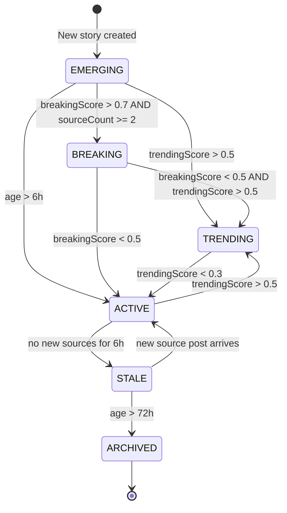

# Section 2 — Product Definition

## Target Users

| Tier | User | Core Need |
|---|---|---|
| Primary | Newsroom editors and producers | Catch breaking stories within minutes of first reports |
| Secondary | Media analysts, PR professionals | Track how stories develop across sources |
| Tertiary | Local government comms staff | Monitor public safety events and community impact |

## Core Use Cases

1. **Breaking news detection** — Surface events within minutes of first reports from any source
2. **Story tracking** — Follow how a story develops across multiple sources and platforms
3. **Source monitoring** — Track what local news orgs, agencies, and LLMs are reporting
4. **Trend analysis** — Identify emerging topics before they break wide
5. **Feed curation** — Create custom RSS feeds for specific beats or topics
6. **Multi-market intelligence** — Monitor multiple metro areas from a single dashboard
7. **AI-assisted verification** — Cross-validate stories across LLM providers and traditional sources

## Key Definitions

### Breaking
A story is **breaking** when:
- It appeared within the last 2 hours
- It has 3+ source posts in 30 minutes from independent sources
- It was not previously tracked
- It shows high engagement velocity
- breakingScore > 0.7

### Trending
A story is **trending** when:
- It shows sustained growth over 6-24 hours
- Engagement is accelerating (not just high)
- Multiple sources continue covering it
- It's beyond routine reporting
- trendingScore > 0.5

### Story Record
Canonical representation of a real-world event. One story may have dozens of source posts.

| Field | Type | Description |
|---|---|---|
| id | string | Unique identifier (cuid) |
| marketId | string? | Which metro area this story belongs to |
| title | string | Headline from highest-trust source |
| summary | string? | Best available description |
| aiSummary | string? | LLM-generated canonical summary |
| category | string? | CRIME, WEATHER, TRAFFIC, POLITICS, BUSINESS, SPORTS, COMMUNITY, EMERGENCY, OTHER |
| status | enum | EMERGING, BREAKING, TRENDING, ACTIVE, STALE, ARCHIVED |
| locationName | string? | Human-readable location |
| latitude/longitude | float? | Geocoded coordinates |
| neighborhood | string? | Specific area within metro |
| breakingScore | float | 0.0-1.0 |
| trendingScore | float | 0.0-1.0 |
| confidenceScore | float | 0.0-1.0 |
| localityScore | float | 0.0-1.0 |
| compositeScore | float | 0.0-1.0 weighted combination |
| sourceCount | int | Number of linked source posts |
| firstSeenAt | datetime | Earliest source post timestamp |
| lastUpdatedAt | datetime | Most recent activity |
| mergedIntoId | string? | Points to canonical story if merged |

### Source Post Record
Individual piece of content from a platform.

| Field | Type | Description |
|---|---|---|
| id | string | Unique identifier |
| sourceId | string | Which Source this came from |
| platformPostId | string | Unique dedup key (e.g., `rss::url::guid`) |
| content | text | Full text content |
| contentHash | string | SHA-256 of normalized text |
| title | string? | Headline if available |
| url | string? | Link to original |
| authorName | string? | Author attribution |
| engagementLikes/Shares/Comments | int | Platform metrics |
| category | string? | Enriched category |
| locationName | string? | Enriched location |
| llmModel | string? | Which LLM generated this (if LLM source) |
| llmConfidence | float? | LLM self-reported confidence |
| publishedAt | datetime | When the content was published |
| collectedAt | datetime | When we ingested it |

## Status Lifecycle

## Multi-Tenant Model

Each **Account** can:
- Configure 1+ **Markets** (metro areas: Houston, Dallas, Austin, etc.)
- Enable/disable **Sources** per market
- Store their own **Credentials** (API keys for NewsAPI, OpenAI, etc.)
- Invite **Users** with role-based access (VIEWER, EDITOR, ADMIN, OWNER)
- Create custom **RSS Feeds** with filtered story output
- Access the **REST API** and **MCP Server** scoped to their account

## Filters and Sorting

### Filters
- Keyword search (across title and summary)
- Category (Crime/Weather/Traffic/Politics/Business/Sports/Community/Emergency)
- Status (Emerging/Breaking/Trending/Active/Stale)
- Time window (1h/6h/24h/7d)
- Minimum composite score
- Source platform (RSS/NewsAPI/Facebook/Twitter/LLM)
- Location/neighborhood
- Market (for multi-tenant)

### Sorting Options
- Composite score (default)
- Breaking score
- Trending score
- First seen (newest first)
- Last updated
- Source count
