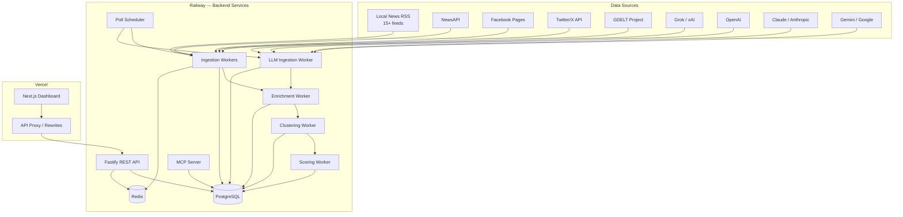

# Section 3 — System Architecture

## Architecture Diagram



## Layered Service Architecture

| Layer | Components | Responsibility |
|---|---|---|
| **Data** | PostgreSQL (Prisma), Redis | Source of truth, queues, cache |
| **Service** | Scoring, clustering, enrichment workers | Business logic, job processing |
| **Internal API** | Fastify routes consumed by frontend | Auth, validation, pagination |
| **External API** | `/api/v1/*` REST endpoints | Third-party access, rate-limited, versioned |
| **Integration** | MCP server, RSS feeds, webhooks | AI assistant access, newsroom tools |
| **Presentation** | Next.js on Vercel | Dashboard UI, admin screens |

## Service Breakdown

| Service | Platform | Justification |
|---|---|---|
| Next.js Frontend | Vercel | Edge CDN, SSR, zero-config deploys, preview branches |
| API Proxy | Vercel Rewrites | Route `/api/*` to Railway without CORS issues |
| Fastify REST API | Railway | Persistent DB connections, no cold starts, long-lived process |
| Worker Service | Railway | Long-running BullMQ processors, independent scaling |
| LLM Worker | Railway | Separate from main worker for cost/rate control |
| MCP Server | Railway | Stdio transport, persistent process for AI assistants |
| PostgreSQL | Railway | Managed, backed up, Prisma migrations |
| Redis | Railway | BullMQ queues, response cache (5-min TTL), rate limiting |

## Data Flow Pipeline

```
1. Poll Scheduler
   ├── Triggers RSS/NewsAPI/Facebook/Twitter/GDELT jobs → ingestion queue
   └── Triggers LLM poll jobs (OpenAI/Claude/Grok/Gemini) → llm-ingestion queue

2. Ingestion Workers (concurrency: 5)
   ├── Fetch source data (RSS XML, JSON APIs, LLM responses)
   ├── Parse and normalize content
   ├── Dedup by platformPostId (unique index guard)
   ├── Create SourcePost record
   └── Enqueue to enrichment queue

3. Enrichment Worker (concurrency: 10)
   ├── Categorize via keyword matching (CRIME, WEATHER, etc.)
   ├── Extract entities (locations, orgs, people) via regex v1
   ├── Detect Houston neighborhoods from 90+ entry list
   ├── Update SourcePost with enrichment data
   └── Enqueue to clustering queue

4. Clustering Worker (concurrency: 5)
   ├── Calculate text similarity (Jaccard on word sets)
   ├── Calculate entity similarity (location/category/neighborhood overlap)
   ├── Calculate time proximity (exponential decay, 2h half-life)
   ├── Combined: 0.6*text + 0.2*entity + 0.2*time
   ├── If best_match > 0.4: add to existing Story
   ├── Else: create new Story with this as primary source
   └── Enqueue to scoring queue

5. Scoring Worker (concurrency: 5)
   ├── Calculate breakingScore (velocity + diversity + recency)
   ├── Calculate trendingScore (growth + engagement + sources)
   ├── Calculate confidenceScore (source count × trust)
   ├── Calculate localityScore (neighborhoods + landmarks)
   ├── Calculate compositeScore (weighted combination)
   ├── Determine status transition
   └── Create ScoreSnapshot for history

6. REST API serves ranked results to frontend and third parties
7. MCP Server exposes query tools for AI assistants
8. RSS Generator builds XML feeds from saved filter definitions
```

## Multi-Tenant Data Isolation

```
Account "Houston Daily"
├── Market: Houston (lat/lon, 80km radius, keywords)
│   ├── Sources: RSS feeds, NewsAPI, Facebook Pages
│   └── Stories: scoped to Houston market
├── Credentials: their own OpenAI key, NewsAPI key, etc.
├── Users: editor@houstondaily.com (ADMIN), reporter@... (EDITOR)
└── RSS Feeds: custom filtered feeds

Account "Texas News Network"
├── Market: Houston
├── Market: Dallas
├── Market: Austin
├── Credentials: their own keys
└── Users: separate user list with separate roles
```

Sources can be **global** (available to all accounts, e.g., GDELT) or **account-specific** (created by that account for their market).

## Key Architectural Decisions

| Decision | Why |
|---|---|
| Fastify over Express | 2-3x faster, built-in schema validation, plugin encapsulation |
| BullMQ over pg-boss/Agenda | Redis-backed, battle-tested, built-in retry/backoff/limiter, good DX |
| Prisma over Drizzle/Knex | Type-safe queries, migration system, Railway-compatible, good ecosystem |
| Separate worker process | Isolation from API, independent scaling, no blocking request handlers |
| LLM as separate queue | Rate limiting and cost control independent from main ingestion |
| JWT + API key dual auth | JWT for frontend users, API key for third-party API consumers |
| Multi-tenant via accountId | Row-level isolation without separate databases — simpler to operate |
