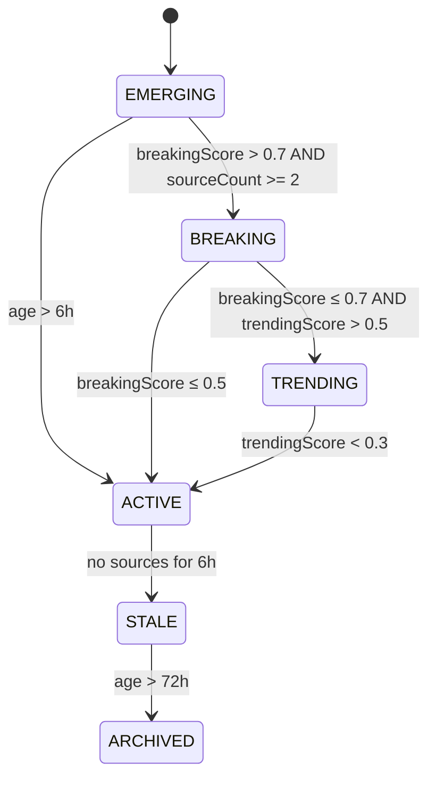

# Section 6 — Scoring and Ranking

All scores normalized to 0.0–1.0.

## Breaking Score

Measures how "breaking" a story is right now. Decays rapidly.

```
velocity_factor  = min(1.0, posts_last_2h / 10)       // 10 posts/2h = max
source_diversity = min(1.0, unique_sources_2h / 5)     // 5 unique sources = max
recency_decay    = exp(-ln(2) × age_hours / 2)         // half-life: 2 hours

breakingScore = 0.4 × velocity + 0.3 × diversity + 0.3 × recency
```

**Edge cases**:
| Condition | Cap |
|---|---|
| Single source only | breakingScore capped at 0.3 |
| All sources from same org (syndicated) | diversity capped at 0.4 |
| Story older than 6 hours | Naturally approaches 0 via decay |
| LLM-only sources (no traditional) | breakingScore capped at 0.2 |

## Trending Score

Measures sustained interest growth over a longer window.

```
growth_rate    = min(1.0, posts_last_6h / max(posts_prev_6h, 1) / 3)
engagement     = min(1.0, total_weighted_engagement / 1000)
source_count   = min(1.0, total_sources_24h / 10)

trendingScore = 0.4 × growth + 0.3 × engagement + 0.3 × sourceCount
```

**Engagement weighting** (adopted from x repo):
```
weighted_engagement = likes × 1 + shares × 2 + comments × 1 + retweets × 3 + quotes × 4
```

## Confidence Score

How confident we are this is a real, verified story.

```
source_factor    = min(1.0, sourceCount / 5)
trust_factor     = avg(source.trustScore) across all linked sources
agreement_factor = 1.0 - (category_disagreement_ratio × 0.5)

confidenceScore = source_factor × trust_factor × agreement_factor
```

| Source Type | Trust Score |
|---|---|
| Local news RSS | 0.8 |
| Government agencies | 0.9 |
| Facebook Pages (official) | 0.6 |
| NewsAPI | 0.8 |
| Twitter/X | 0.5 |
| GDELT | 0.7 |
| LLM (Grok) | 0.35 |
| LLM (OpenAI/Claude/Gemini) | 0.3 |
| Unknown/new sources | 0.3 |

## Locality Score

How relevant this is to the specific metro market.

```
neighborhood_factor: 1.0 if specific neighborhood mentioned
                     0.5 if city name ("Houston") mentioned
                     0.2 if county ("Harris County") only
location_specificity: 1.0 if specific address/intersection
                      0.7 if neighborhood
                      0.4 if city-level
source_locality: 1.0 if source is Houston-local
                 0.6 if Texas-wide
                 0.3 if national

localityScore = avg(per-post locality) across all source posts
```

Bonus for Houston-specific landmarks: NRG Stadium, Minute Maid Park, Toyota Center, Texas Medical Center, Hermann Park, Buffalo Bayou, Johnson Space Center, Port of Houston (+0.1 each, capped at 1.0).

## Composite Score

```
compositeScore = 0.35 × breakingScore
               + 0.25 × trendingScore
               + 0.20 × confidenceScore
               + 0.20 × localityScore
```

## Decay Functions

| Mechanism | Behavior |
|---|---|
| Breaking decay | `exp(-age/2)` — half-life 2 hours |
| Re-scoring | Every 10 minutes for all non-archived stories |
| Status: STALE | No new sources for 6 hours |
| Status: ARCHIVED | Age > 72 hours of inactivity |

## Status Transition Rules



## Anomaly Detection (v2)

- Track rolling average of stories/hour over last 7 days
- If current hour has 3× the rolling average → potential major event
- Alert admin when anomaly detected
- Temporarily adjust breaking thresholds during major events (lower bar so more stories surface)

## Anti-Gaming Considerations

| Risk | Mitigation |
|---|---|
| Engagement farming | Engagement metrics are secondary signals (max 30% weight), not primary |
| Source trust manipulation | Trust scores are admin-controlled, not automated |
| Syndicated article flooding | Same-org duplicates counted as one source for diversity |
| LLM hallucination | LLM sources capped at 0.3 trust, never primary for BREAKING |
| Fake source injection | New/unknown sources start at trustScore 0.3 |
| Score manipulation via rapid posting | Velocity capped, diversity required for high breaking score |
