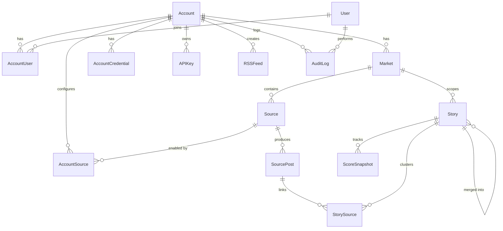

# Section 7 — Data Model

## Database Stack

| Component | Technology | Purpose |
|---|---|---|
| Primary DB | PostgreSQL 16 (Railway managed) | Source of truth for all data |
| ORM | Prisma 5.x | Type-safe queries, migrations |
| Cache/Queues | Redis 7 (Railway managed) | BullMQ job queues, response cache (5-min TTL), rate limiting |
| Future | pgvector extension | Semantic similarity search (v2) |

## Entity-Relationship Diagram



## Models Summary

### Multi-Tenant Core

| Model | Purpose | Key Fields |
|---|---|---|
| **Account** | Tenant organization | name, slug, plan (free/pro/enterprise), maxMarkets, maxSources |
| **User** | Individual login | email (unique), passwordHash, displayName |
| **AccountUser** | User-account membership | role (VIEWER/EDITOR/ADMIN/OWNER), isActive |
| **Market** | Metro area for a tenant | name, slug, lat/lon, radiusKm, timezone, keywords[], neighborhoods[] |
| **AccountCredential** | Per-account API keys | platform, apiKey (encrypted), apiSecret, accessToken, lastError |
| **AccountSource** | Source enable/disable per account | isEnabled, pollIntervalMs override |

### News Pipeline

| Model | Purpose | Key Fields |
|---|---|---|
| **Source** | Ingestion source definition | platform, sourceType, name, url, trustScore, isGlobal, marketId |
| **SourcePost** | Individual content item | platformPostId (unique), content, contentHash, category, llmModel, llmConfidence |
| **Story** | Canonical event record | title, aiSummary, category, scores×5, status, sourceCount, marketId |
| **StorySource** | Post-to-story link | similarityScore, isPrimary |
| **ScoreSnapshot** | Score history | all 5 scores at a point in time |

### Supporting

| Model | Purpose | Key Fields |
|---|---|---|
| **RSSFeed** | Saved feed definitions | name, slug, filters (JSONB), isPublic, accountId |
| **APIKey** | Third-party API access | key (unique), ownerId, rateLimit, accountId |
| **AuditLog** | Activity tracking | action, entityType, entityId, accountId, userId |

## Key Indexes

```sql
-- Source queries
Source(platform, isActive)
Source(marketId)
Source(isGlobal)

-- Dedup guards (CRITICAL)
SourcePost(platformPostId) -- UNIQUE
SourcePost(contentHash)
StorySource(storyId, sourcePostId) -- UNIQUE

-- Story ranking queries
Story(compositeScore DESC)
Story(breakingScore DESC)
Story(trendingScore DESC)
Story(status, compositeScore DESC)  -- most common query
Story(marketId, status, compositeScore DESC)  -- multi-tenant scoped

-- Time-based queries
SourcePost(sourceId, publishedAt)
SourcePost(publishedAt)
Story(firstSeenAt DESC)
ScoreSnapshot(storyId, snapshotAt DESC)

-- Audit
AuditLog(accountId)
AuditLog(entityType, entityId)
AuditLog(createdAt DESC)
```

## Key Design Decisions

1. **Self-referential Story.mergedIntoId**: When stories are merged, one becomes canonical and others point to it. API follows mergedIntoId transparently.

2. **ScoreSnapshot table**: One row per story per scoring run. Enables trend analysis and debugging. Pruned: hourly after 24h, daily after 7d.

3. **JSONB for flexible fields**: Source.metadata, SourcePost.rawData, RSSFeed.filters, AccountCredential.extraConfig — avoids schema migrations for evolving shapes.

4. **Separate contentHash**: Indexed for fast exact-dupe checks without expensive text comparison.

5. **Per-account credential isolation**: AccountCredential stores encrypted API keys. Never returned in API responses (masked with `maskSecret()`).

6. **Row-level multi-tenancy**: Stories scoped via marketId, which links to accountId. No separate databases — simpler to operate and query.

7. **LLM-specific fields on SourcePost**: `llmModel` and `llmConfidence` allow scoring to weight LLM sources differently from traditional sources.
